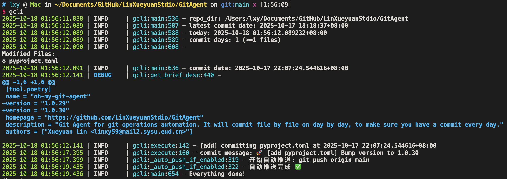

# GitAgent

  

## 简介

GitAgent 是一个用于自动化 Git 提交的命令行工具。它会按“逐文件、逐日”策略生成提交，帮助你的提交历史保持每日都有提交；并且可选用 AI 自动生成简短、带表情的提交信息。



## 安装

```bash
pip install oh-my-git-agent
```

## 快速开始

```bash
# 在当前仓库根目录运行，将逐个文件提交，提交时间均匀分布在最近一次提交与今天之间
gcli

# 指定仓库路径（可以在任意目录运行）
gcli --repo-dir .

# 提交完后推送到远端
git push origin main
```

## 生成 AI 提交信息（可选）

默认使用 DeepSeek（兼容 OpenAI 协议）。

```bash
# 使用 DeepSeek（默认 base-url 与模型）
gcli --ai --api-key sk-your-deepseek-key --repo-dir .

# 使用 OpenAI 官方（需显式指定 base-url 与模型）
gcli --ai \
		 --base-url https://api.openai.com/v1 \
		 --model gpt-4o-mini \
		 --api-key sk-your-openai-key \
		 --repo-dir .
```

注意：
- 未开启 `--ai` 时，提交信息形如 `chore add filename`/`chore rm filename`。
- AI 生成时，会优先使用 diff 片段（或小于约 10MB 的文本文件内容前 1024 字节）辅助生成简短信息。

## 查看与筛选变更

```bash
# 列出工作区变更并编号（彩色输出）
gcli --ls

# 等价的子命令用法
gcli ls
```

仅提交某个文件或目录下的变更：

```bash
# 仅提交 src/ 目录内的变更（保持逐文件、时间均匀策略）
gcli only src/ --repo-dir .
```

## 工作原理（概要）

- 收集工作区的新增、修改、删除、未跟踪文件。
- 计算“最近一次提交时间”至“当前时间”的时间段，并将本次待提交的文件数量均匀分布在该区间（或按天顺延）。
- 按时间先后顺序逐文件提交；AI 模式下为每个文件生成一句话提交说明。
- 默认忽略 `.git/` 目录；对体积较大的文件不会读取全文。

## 命令参考

```bash
$ gcli --help

Usage: gcli [OPTIONS]

	自动填写 commit 信息提交代码

Options:
	--repo-dir TEXT   git 仓库目录  [default: .]
	--ls / --no-ls    列出当前工作区变更并编号  [default: no-ls]
	--ai / --no-ai    是否使用 AI 填写 commit 信息  [default: no-ai]
	--api-key TEXT    OpenAI API Key  [default: None]
	--base-url TEXT   OpenAI API URL  [default: https://api.deepseek.com]
	--model TEXT      OpenAI Model  [default: deepseek-chat]
	--install-completion  Install completion for the current shell.
	--show-completion     Show completion for the current shell.
	--help                Show this message and exit.
```

子命令：

```bash
$ gcli ls --help
Usage: gcli ls [OPTIONS]

	列出当前工作区变更并编号（彩色输出）

Options:
	--repo-dir TEXT  git 仓库目录  [default: .]
	--help           Show this message and exit.
```

```bash
$ gcli only --help
Usage: gcli only [OPTIONS] TARGET

	仅提交指定文件或目录下的变更

Arguments:
	TARGET  目标文件或目录路径，相对或绝对均可  [required]

Options:
	--repo-dir TEXT  git 仓库目录  [default: .]
	--ai / --no-ai   是否使用 AI 填写 commit 信息  [default: no-ai]
	--api-key TEXT   OpenAI API Key  [default: None]
	--base-url TEXT  OpenAI API URL  [default: https://api.deepseek.com]
	--model TEXT     OpenAI Model  [default: deepseek-chat]
	--help           Show this message and exit.
```

## 常见问题（FAQ）

- OpenAI/DeepSeek 连接失败？请确认 `--base-url` 与 `--model` 是否与供应商匹配，Key 是否有效，网络是否可达。
- 只想“看变更不提交”？使用 `gcli --ls` 或 `gcli ls`。
- 如何安装补全？运行 `gcli --install-completion`，然后按提示将补全脚本加载到当前 Shell。
- 提交信息太长？工具会截断用于生成的上下文（默认最多约 1024 字符）。

## 许可与链接

- 许可：MIT（见 `LICENSE`）
- 源码与主页：<https://github.com/LinXueyuanStdio/GitAgent>
- PyPI：<https://pypi.org/project/oh-my-git-agent/>

